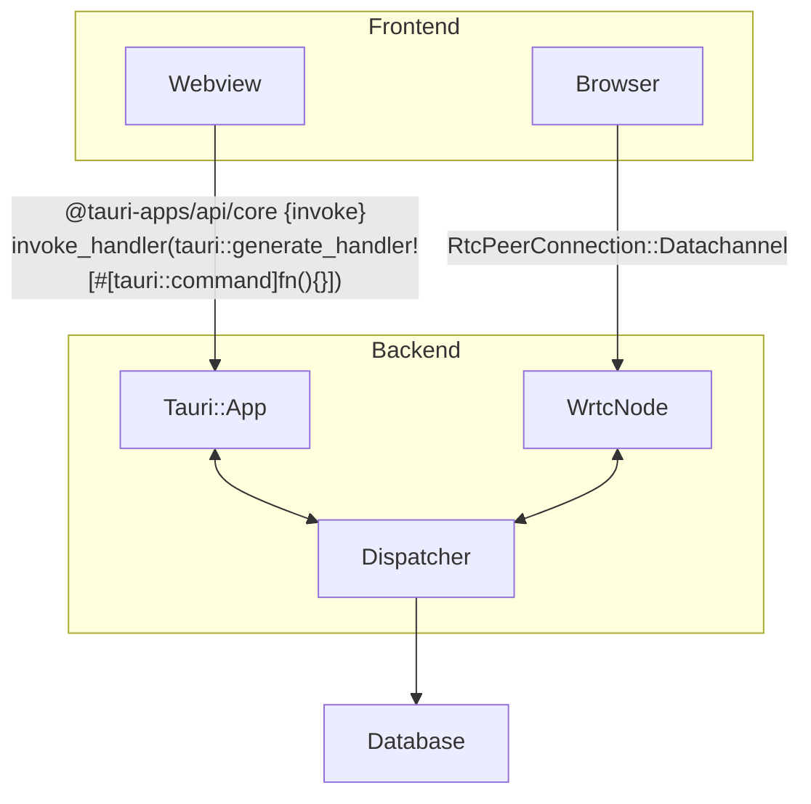

## Target platforms
The choice is defined by the following goals:
1. Avoid using platform specific code and frameworks
2. Make results available on as many devices as possible. 
3. Providing remote access to the database from different devices.
4. Be lightweight (relatively)
Leaning towards web was a natural choice, but I also wanted to have a flexibility of not using browsers.

The application runs and should potentially run on:
1. On desktops
2. In browsers, with backend service handling CRUD requests from the web frontend.
3. Mobile
4. Embedded (backend)

## Frameworks:
React based UI framework was used to have UI reuseable in Web, Mobile and  desktop with minimal configuration. Most obvious two pathways were to use either Tauri or Electron.
Tauri was selected, because:
1. It uses the rendering engine provided by the system, instead of bundling its own, so the app would be more lightweight
2. Tauri is more memory efficient, as it compiles into native code and does not run Node.js + Chromium processes.
3. UI code written for desktop Tauri can be reused in mobile
4. I wanted to try Rust
 

## Components overview
### Conceptual elements
For now the implementation is done for web and desktop.
The layout is shown in the diagram below.

#### <a id="components_db">Database</a>
Data is stored in SQLite for now.
It is managed by a [controller layer](#components_dispatcher), that is responsible for providing a unified interface for backend operations and data handling.

#### <a id="components_backend">Backend</a>
Elements that are responsible for handling user input and working with database
##### <a id="components_dispatcher">Dispatcher</a>
Handles database connection and user requests. Enforces a message format for backend requests that must be followed by frontend implementations.
##### <a id="components_tauri">Tauri::app</a>
The entity handling WebView rendering and client input as IPC requests. Client effectively sends messages directly into the [dispatcher](#components_dispatcher) through the framework.
##### <a id="components_rtc">WrtcNode</a>
Here messages come over a WebRtc datachannel. Backend has a P2P connection to the browser and messages are delivered using a simple data exchange protocol. The WrtcNode handles the connectivity and (un)wraps [dispatcher](#components_dispatcher) messages from/into the datachannel message format.

#### <a id="components_frontend">Frontend

##### <a id="components_browser">Browser
The user facing code running on browser

##### <a id="components_web">Webview
The user facing code running on desktop

### Communication protocol

