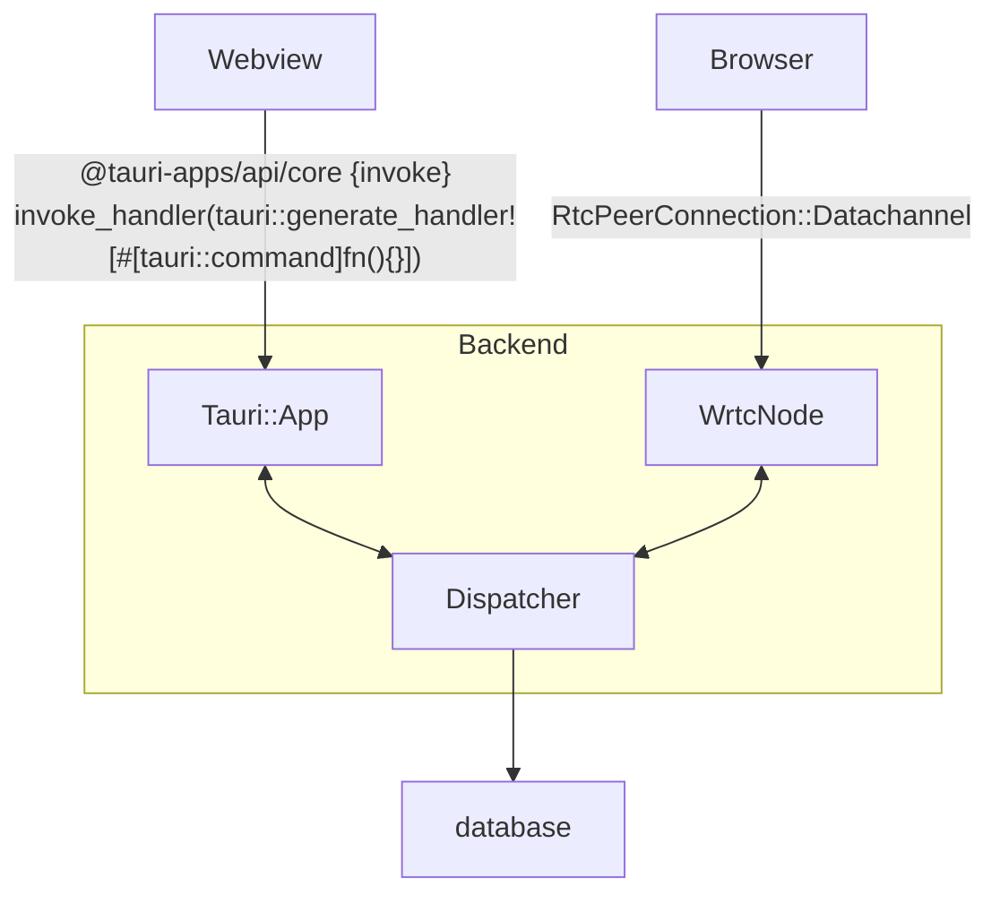

The 
The communication happens

```mermaid
flowchart
    subgraph Backend
        tauri_app["Tauri::App"]
        WrtcNode
        queue["Dispatcher"]
    end
    Webview --> |"@tauri-apps/api/core {invoke}<br>invoke_handler(tauri::generate_handler![#[tauri::command]fn(){}])"|tauri_app
    tauri_app <--> queue
    Browser --> |RtcPeerConnection::Datachannel| WrtcNode
    WrtcNode <--> queue
    queue --> database
```