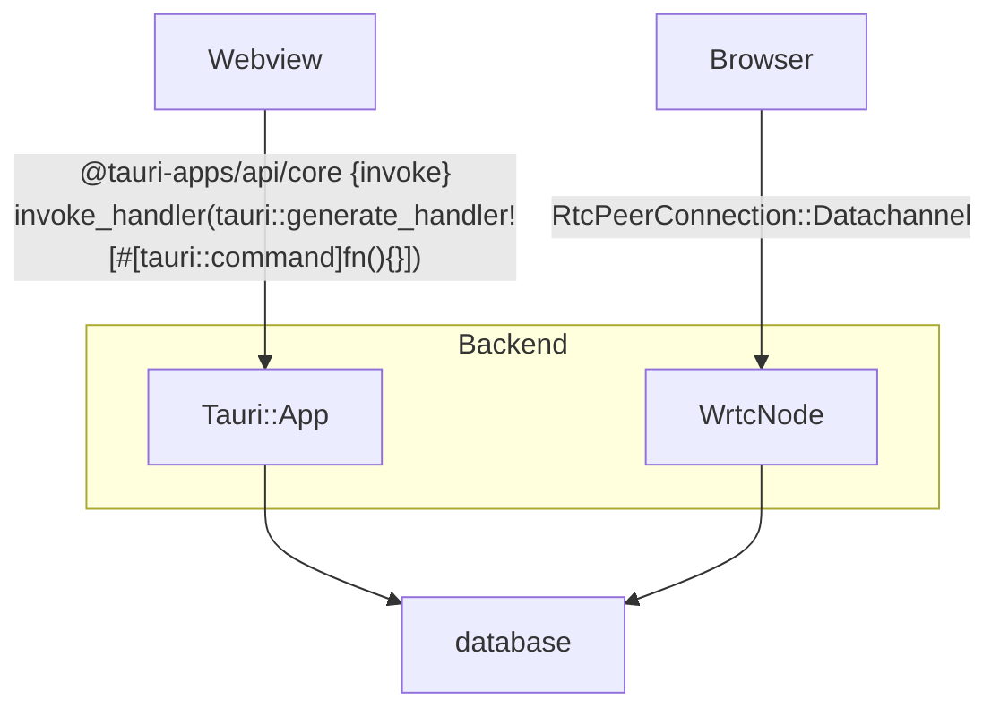

This is a backend service managing database and handling requests from Tauri/webview or browser client.

The requests come either as a 

```mermaid
flowchart


subgraph Backend
    tauri_app["Tauri::App"]
    WrtcNode
end
Webview --> |"@tauri-apps/api/core {invoke}<br>invoke_handler(tauri::generate_handler![#[tauri::command]fn(){}])"|tauri_app
tauri_app --> database
Browser --> |RtcPeerConnection::Datachannel| WrtcNode
WrtcNode --> database
```

