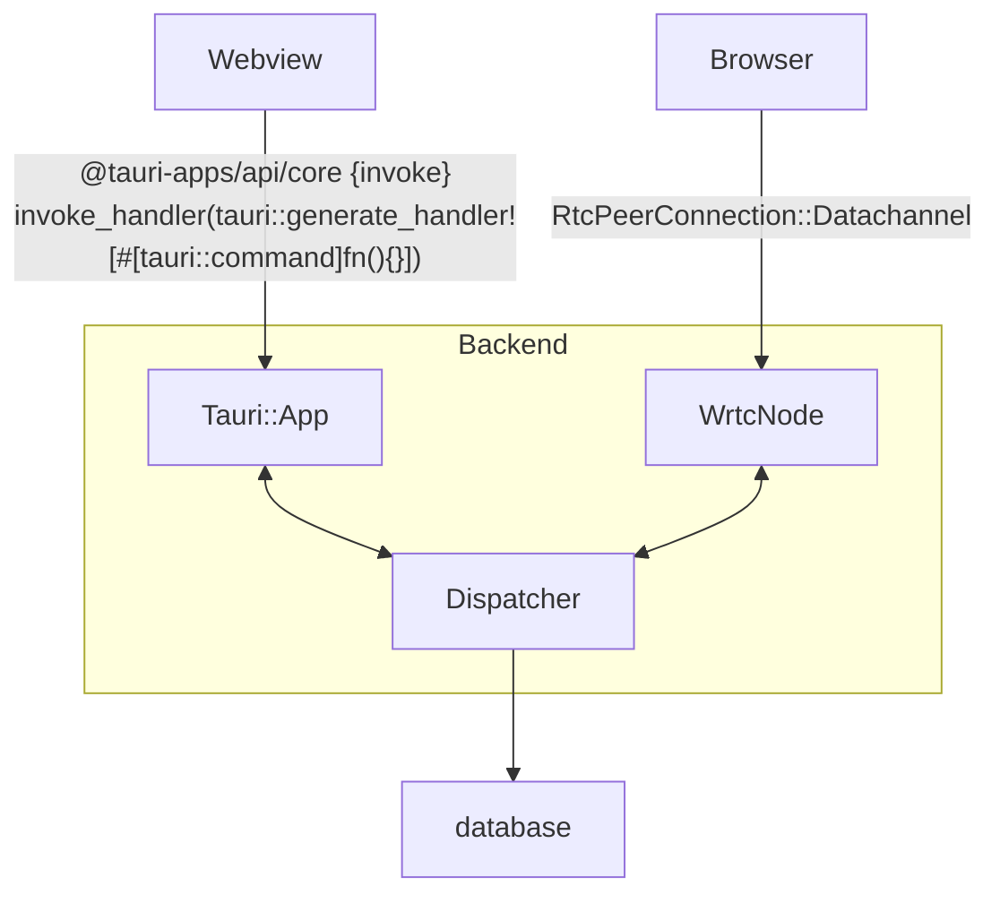

This is a backend service managing database and handling requests from Tauri/webview or browser client.

Since the backend manages requests from authorised users, rate limiting or request serialisation is not enforced. Only metrics like max request duration and max in flight reqeusts are introduced for monitoring.

Currently Tauri app and the webrtc app are planned to run in parallel.
Conflicts should be resolved by:
1. Updating track info by checking old data against new one
2. Simple rate limiting of listen tracking - can loose some progress if both frontends overlap listening - but this case is not planned to be covered. In other words, if I use Web version it makes no sense to use Desktop version at the same time. Making extra checks or architecture decisions to accomodate for that seems unnecessary right now.

Maybe on any track update i should send current data and update to new one only if the data i see is the data the database has - that is to brevent corruption from parallel use.