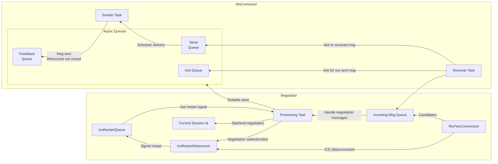
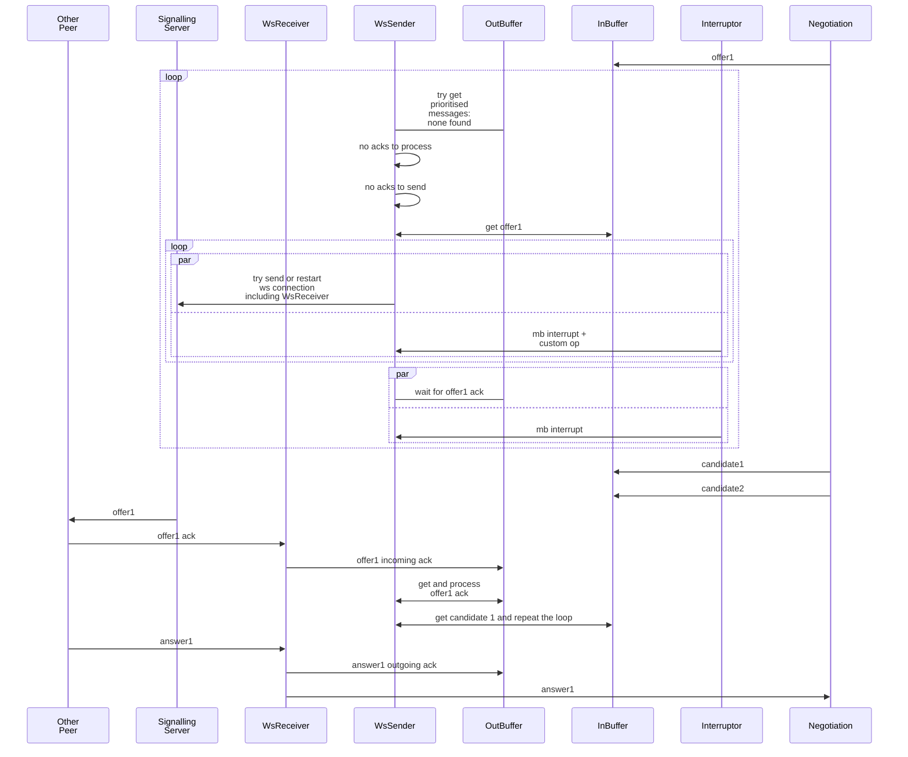

This is a rust implementation of a routine establishing ICE datachannel using a websocket signalling server.

It's goal is to open RTCPeerConnection to other peer and a datachannel over it and maintain both.

To do that, a connection to signalling server and to a turn server need to be maintained as well.

### Control Flow

There are several parallel contorl flows:
1. #### Connection to signalling server:

    Keep reestablishing connection while it is required. Otherwise close it.
2. #### Connection to another participant:

    Signalling server [does not provide message forwarding feedback](../signalling/memo.md##sec_no_forward_ack) and its design allows an unreliable delivery to another peer:
    ```mermaid
    sequenceDiagram
        p1 ->> ss: connect
        p1 ->> ss: offer1
        rect rgb(260, 200, 200)
        ss ->> ss: discard offer1
        end
        p2 ->> ss: connect
        p1 ->> p1: resend timeout
        p1 ->> ss: resend offer1
        ss --x p2: connection lost
        rect rgb(260, 200, 200)
        ss ->> ss: discard offer1
        end
        ss -> p2: connection restored
    ```
    #### Ack messages
     Ack messages were introduced for faster failure detection.
    
     Acks are are sent back to sender, so that this sender can identify networking issue and retry the delivery. 
     
     Delivery retries were decided to move away from the [negotiation layer](#negotiation-handling) for simplicity. Negotiator will only track stale state timeout to restart negotiation itself, not to resend concrete messages (out buffer overflow = failure to send, timeout = clear buffer and renegotiate).

     #### Unordered messages
     But even with delivery confirmation there is a problem of unordered message delivery, which would prompt some message buffering and preprocessing on a receiver's side:

      ```mermaid
    sequenceDiagram
        participant p1
        participant ss
        participant p2
        rect rgb(220, 200, 200)
        note over p1, p2: unordered offer1 caused missing candidate 1
        p1 ->> ss: offer1
        ss --x p2: conenction drop
        p1 ->> ss: candidate 1
        ss ->> ss: offer1 drop
        ss -> p2: connection restore
        ss ->> p2: candidate1
        p2 ->> p1: candidate1 ack
        rect rgb(260, 200, 200)
        p2 ->> p2: candidate 1 ignored
        p1 ->> p2: offer1 resend
        p2 ->> p2: RTCPeerConnection create
        end
        end

        rect rgb(220, 200, 200)
        note over p1, p2: failed offer delivery and offer reset promote wrong offer
        p1 ->> ss: offer1
        ss --x p2: conenction drop
        p1 ->> p1: offer reset
        ss -> p2: connection restore
        rect rgb(260, 200, 200)
        p1 ->> p2: offer2
        p1 ->> p2: resend offer1
        end
        end
    ```
    Such [lack of order](#unordered-messages) is addressd by:
    1. <a id="unordered_signalling_messages_payload_seq_num">Sequence numbers</a> in payload messages.
    2. <a id="unordered_signalling_messgaes_hol">Send one message at a time</a>. It was chosen as an alternative to a reorder buffer to keep code simpler and message flow more steady as low latency is not as critical in the negotiation stage at this scale.

3. #### Negotiation handling:
    The core principles are described in https://developer.mozilla.org/en-US/docs/Web/API/WebRTC_API/Perfect_negotiation - polite peer will disregard negotiation that he initiated and take impolite peer's offer for basis.

    ```mermaid
    sequenceDiagram
        participant p1 as Polite
        participant ss
        participant p2 as Impolite
        p1 ->> ss: polite offer
        p2 ->> ss: impolite offer
        ss ->> p1: impolite offer
        ss ->> p2: polite offer
        p2 ->> p2: drop polite offer
        p1 ->> p1: rollback and take impolite offer
        p1 ->> p2: impolite answer
    ```
    ### Stale answers and candidates

    Even with measures against [message loss](#ack-messages) and [reordering](#unordered-messages) there are several unhappy paths (UPs) that might cause wrong answers or candidate messages be addressed to negotiations session:

    ```mermaid
    sequenceDiagram
        participant p1 as Polite
        participant ss
        participant p2 as Impolite

          
        rect rgb(220, 200, 200)
        note over p1,p2: UP - reset offer - stale answer
        p1->>ss: offer1
        p1->>p1: reset offer
        ss->>p2: offer1
        p2->>ss: answer1
        rect rgb(260, 200, 200)
        p1->>ss: offer2
        ss->>p1: answer1
        end
        end
 
        rect rgb(220, 200, 200)
        note over p1,p2: UP - reset offer - stale answer 2
        p1->>ss: offer1
        p2->>ss: offer2
        ss->>p2: offer1
        p2->>p2: discard offer1
        ss->>p1: offer2
        p1->>p1: rollback offer1
        p1->>ss: answer2
        p2->>p2: reset connection
        rect rgb(260, 200, 200)
        p2->>ss: offer3
        ss->>p2: answer2
        end
        end
    ```
    
    <a id="negotiation_session_id">Negotiation session id</a> is introduced to make sure that session receives messages relevant to current sdp pair.


### Signalling connection handling pipeline
if i get ack to element in the out q , then i get another one when i resend it and i cant get one before i send it.





### Restarting ICE
1. 


#### Implementation

1. Signalling:
```

struct WireMessage<T> {
    // look up ws_server implementation, probably should make a common type
    tag: String,
    message: Option<T>
}
struct WsTransportMsg<T> {
    seq_num: u64,
    node_id: String
    payload: Option<T>
}

enum InterruptorMsg {
    CancelAndClearQueue,
    RestartWsSocket // if added after ws restart - the queue will be cleaned up before starting
}

struct IncomingMsgHandler<T> {
    IncomingMsgHandler() {
        
    }
    to_transport(msg: String) => WireMessage<WsTransportMsg<T>> {
        return sede_parse_or_something(msg)?;
    }
    handle(s_msg: T) {
        
    }
}

fn schedule_ack_send(send_q_handle: mpsc_handle) {

}

fn startReceiveTask<T>(rx, stopper, receipt_handler, mb_filter_msg, ack_q, send_q) -> JoinHandle {
    return tokio::spawn(move [rx, stopper, mb_filter_msg, receipt_handler, ack_q, send_q]() => {
        while {
            select {
                match rx.next() {
                    Ok(msg_raw) => {
                        const wire_msg: WireMessage<WsTransportMsg<T>> = receipt_handler.to_transport(msg_raw);
                        const t_msg = wire_msg.message;
                        const ack = {t_msg.seq_num, t_msg.node_id};
                        if (t_msg.payload) {
                            send_ack(t_msg.id, t_msg.seq_num);
                            mb_filter_msg(t_msg);
                            receipt_handler(msg_raw).ignore_error();
                        } else {
                            ack_q.send({t_msg.seq_num, t_msg.node_id})
                        }
                    }
                    Err() => {
                        stopper.cancel();
                        break;
                    }
                }
                stopper_clone.cancelled() {
                    break;
                }
            }
        }
        return { rx, last_node_id, last_seq_num }
    })
}
struct WsConnector {
    sender_task: JoinHandle
    receiver_task: JoinHandle;
    send_fb: mpsc_out_handle;
    send_q: mpsc_in_handle;
    ack_q: mpsc_in_handle;
    stopper: CancelToken;

    last_seq_num: Wrapped<u64>;
    last_in_node_id: String;

    seq_num_out: Wrapped<u64>;
    node_id_out: String;
    receipt_handler: Arc<IncomingMsgHandler>; //could be a generic trait with a handle(T) function 
    new(url, rtt_tag, node_id, last_seq_number) => ConnectionHandler {
        this.last_in_node_id = node_id;
    }
    mb_filter_msg(seq_num, node_id) {
        //if never seen this id, assign and start tracking, 
        // otherwise check if this seq num is not smaller or the same as the one received before; 
        // Add required state
    }
    makeSender(send_fb_in: mspc_in_handle) {
        loop {
            const (rx, tx) = tungstenite_whatever::open(url);
            const receive_handle = startReceiveTask(rx, 
                                                    this.stopper.clone(),
                                                    this.receipt_handler.clone(),
                                                    this.ack_q.clone(),
                                                    this.send_q.clone()
            );
            select {
                receive_handle
                this.stopper.cancelled() {
                    tx.close()
                    return;
                }
            }
        }
        makeSender(send_fb_in)
    }
    stop() {
        this.stopper.cancel();
    }
    send_and_wait_ack(msg_out: WsTransportMsg<SignalMsg>,
                      ack_q&, send_q&) {
        match send_q.try_send(msg_out).await {
            Ok() => _;
            Err() => {
                // can't send the message (buffer full or somehting else) to ws - restart connection
            }
        }

        loop {
            match send_fb.next().await {
                Ok(seq_num, id) => {
                    if (seq_num != sn || id != msg_out) {
                        //some cancelled leftovers
                        continue;
                    }
                    break;
                }
                Err() => // can't send the message (buffer full or somehting else) to ws - restart connection
            }
        }
        loop {
            match this.ack_q.next() {
                Ok(ack) => {
                    //we might be getting old acks, those are safe to be ignored.
                    if (seq_num == ack.seq_num) {
                        return Ok();
                    }
                    //ignore unexpected akk and keep waiting.
                    continue;
                }
                Err() => queue closed for some reason...likely fatal. log and record metrics for the event and drop the connection to have it restarted
            }
        }      
    }
    send_and_wait_ack_repeated(msg_out: WsTransportMsg<SignalMsg>,
                      ack_q&, send_q&) {
        loop {
            select {
                sleep(6s) => {
                    continue;
                }
                match send_and_wait_ack() {
                    Ok() => return Ok()
                    Err() => Err(drop the connection - somethingwent wrong)
                }
            }            
        }               
    }

    send_ack(sn, id) {
        const msg_out: WsTransportMsg<SignalMsg> = {sn, id};
        match send_q.try_send(msg_out).await {
            Ok() => _;
            Err() => {
                // can't send the message (buffer full or somehting else) to ws - restart connection
            }
        }
        // Don't wait for feedback - acks are plumbing
        // ans should be sent at best effort
        // Sender queue should not schedule feedback for those
    }
    send(msg: SignalMsg) {
        const sn = this.seq_num_out.next();
        const id = this.node_id_out;
        const msg_out: WsTransportMsg<SignalMsg> = {sn, id, msg};
        // infinite send. can be blocked by cancelling the delivery from outside
        // there is no reason to handle redelivery elsewhere, so it will be handled at this level
        select {
            send_and_wait_ack_repeated(msg_out, this.ack_q, this.send_q)
            this.stopper.is_cancelled() => Err(the stopper wil decide what to do)
        }
    }
}

struct ConnectionHandler {
    node_id: String;
    (tx,rx): wsstreams;
    negotiation_queue: mpsc;
    prioritized_queue: mpsc;
    interruptor_queue: mpsc;
    new(url) => ConnectionHandler {
        node_id = new Uuid();
        this.(rx, tx) = tungstenite_whatever::open(url);
    }
    send(msg: SignalMsg, interruptor) {

    }
}
```
2. Negotiation:
Don't optimise incoming message queue: if i have offer2 and a queue holds [candidate2, candidate1, offer1], i won't remove scheduled messages, to separate concerns and because such cases should be rare.

```

struct SignalType {
    Offer,
    Answer,
    Candidates
}

struct SignalMsg {
    neg_sid: String,
    type: SignalType,
    payload: JSONValue
}

```
Single task per NSession to serialise state updates.
```
struct NSession {
    id: String;
    is_polite: bool;
    is_negotiating: bool;
    new(rtc_con) {
        rtc_con.on_ice_con_state_change
        (state => {
            // serialise hanling
            if state == failed 
        })

        rtc_con.on_ice_candidate(candidate=> {
            //serialise handling
        })

        rtc_con.on_negotiation_needed(() => {
            //serialise handling
        })
    }
    drop() {
        //retract pending sdps.
    }
    start() => RtcPeerConnection {

    }
    handleOffer(session_id, offer) {
        /* Possible cases:
        1. same offer
        2. new offer
        3. old offer - can't be in current set up. Can be in complex deployment and a service routing glitch. Not handled.
        */
    }
    handleAnswer(session_id, answer) {
        /* Possible cases:
        1. Answer to old offer
        2. Answer to current offer
        3. Answer when no offer (session will be closed outside - unexpected)
        // note - RTCPeerConnection::signaling_state - for state
        if (this.session_id != session_id) {
            return;
        }
    }
    handleCandidate(session_id, candidate) {
        if (this.session_id != session_id) {
            return;
        }
    }
}
```