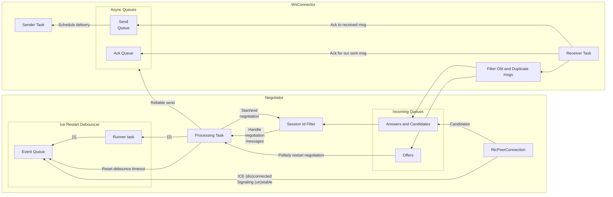
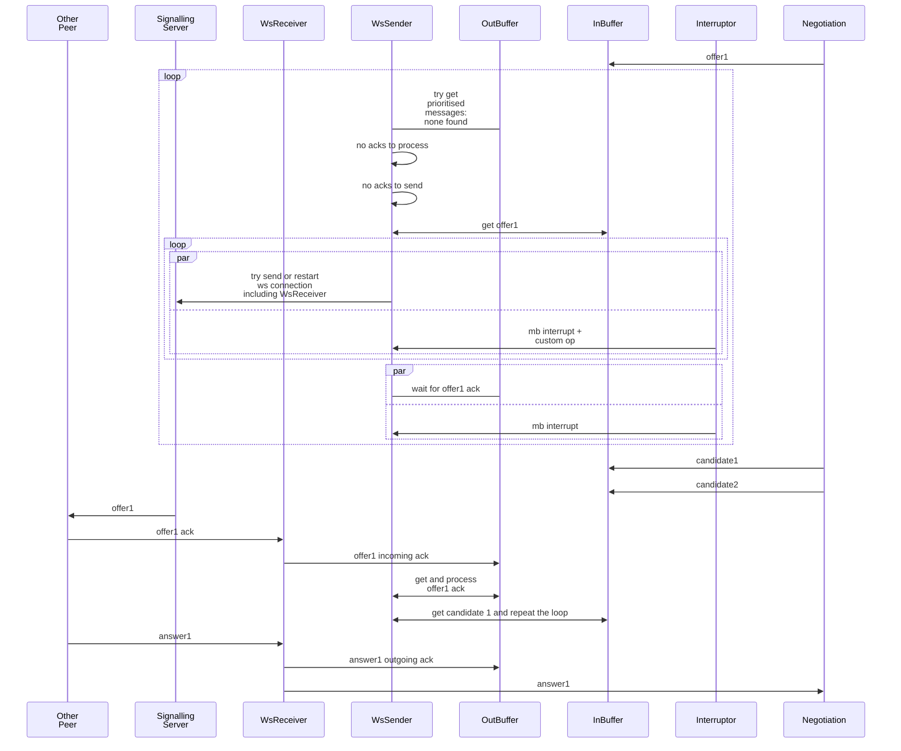
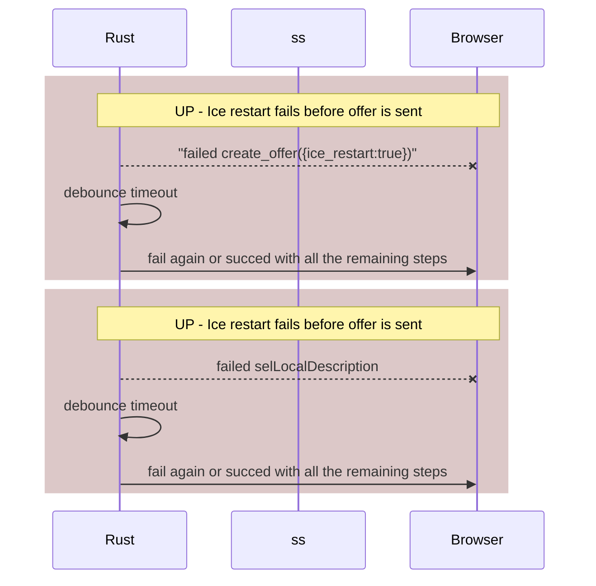

This is a rust implementation of a routine establishing ICE datachannel using a websocket signalling server.

It's goal is to open RTCPeerConnection to other peer and a datachannel over it and maintain both.

To do that, a connection to signalling server and to a turn server need to be maintained as well.

### Control Flow

There are several parallel contorl flows:
1. #### Connection to signalling server:

    Keep reestablishing connection while it is required. Otherwise close it.
2. #### Connection to another participant:

    Signalling server [does not provide message forwarding feedback](../signalling/memo.md##sec_no_forward_ack) and its design allows an unreliable delivery to another peer:
    ```mermaid
    sequenceDiagram
        p1 ->> ss: connect
        p1 ->> ss: offer1
        rect rgb(260, 200, 200)
        ss ->> ss: discard offer1
        end
        p2 ->> ss: connect
        p1 ->> p1: resend timeout
        p1 ->> ss: resend offer1
        ss --x p2: connection lost
        rect rgb(260, 200, 200)
        ss ->> ss: discard offer1
        end
        ss -> p2: connection restored
    ```
    #### Ack messages
     Ack messages were introduced for faster failure detection.
    
     Acks are are sent back to sender, so that this sender can identify networking issue and retry the delivery. 
     
     Delivery retries were decided to move away from the [negotiation layer](#negotiation-handling) for simplicity. Negotiator will only track stale state timeout to restart negotiation itself, not to resend concrete messages (out buffer overflow = failure to send, timeout = clear buffer and renegotiate).

     #### Unordered messages
     But even with delivery confirmation there is a problem of unordered message delivery, which would prompt some message buffering and preprocessing on a receiver's side:

      ```mermaid
    sequenceDiagram
        participant p1
        participant ss
        participant p2
        rect rgb(220, 200, 200)
        note over p1, p2: unordered offer1 caused missing candidate 1
        p1 ->> ss: offer1
        ss --x p2: conenction drop
        p1 ->> ss: candidate 1
        ss ->> ss: offer1 drop
        ss -> p2: connection restore
        ss ->> p2: candidate1
        p2 ->> p1: candidate1 ack
        rect rgb(260, 200, 200)
        p2 ->> p2: candidate 1 ignored
        p1 ->> p2: offer1 resend
        p2 ->> p2: RTCPeerConnection create
        end
        end

        rect rgb(220, 200, 200)
        note over p1, p2: failed offer delivery and offer reset promote wrong offer
        p1 ->> ss: offer1
        ss --x p2: conenction drop
        p1 ->> p1: offer reset
        ss -> p2: connection restore
        rect rgb(260, 200, 200)
        p1 ->> p2: offer2
        p1 ->> p2: resend offer1
        end
        end
    ```
    Such [lack of order](#unordered-messages) is addressd by:
    1. <a id="unordered_signalling_messages_payload_seq_num">Sequence numbers</a> in payload messages.
    2. <a id="unordered_signalling_messgaes_hol">Send one message at a time</a>. It was chosen as an alternative to a reorder buffer to keep code simpler and message flow more steady as low latency is not as critical in the negotiation stage at this scale.

3. #### Negotiation handling:
    The core principles are described in https://developer.mozilla.org/en-US/docs/Web/API/WebRTC_API/Perfect_negotiation - polite peer will disregard negotiation that he initiated and take impolite peer's offer for basis.

    ```mermaid
    sequenceDiagram
        participant p1 as Polite
        participant ss
        participant p2 as Impolite
        p1 ->> ss: polite offer
        p2 ->> ss: impolite offer
        ss ->> p1: impolite offer
        ss ->> p2: polite offer
        p2 ->> p2: drop polite offer
        p1 ->> p1: rollback and take impolite offer
        p1 ->> p2: impolite answer
    ```
    ### Stale answers and candidates

    Even with measures against [message loss](#ack-messages) and [reordering](#unordered-messages) there are several unhappy paths (UPs) that might cause wrong answers or candidate messages be addressed to negotiations session:

    ```mermaid
    sequenceDiagram
        participant p1 as Polite
        participant ss
        participant p2 as Impolite

          
        rect rgb(220, 200, 200)
        note over p1,p2: UP - reset offer - stale answer
        p1->>ss: offer1
        p1->>p1: reset offer
        ss->>p2: offer1
        p2->>ss: answer1
        rect rgb(260, 200, 200)
        p1->>ss: offer2
        ss->>p1: answer1
        end
        end
 
        rect rgb(220, 200, 200)
        note over p1,p2: UP - reset offer - stale answer 2
        p1->>ss: offer1
        p2->>ss: offer2
        ss->>p2: offer1
        p2->>p2: discard offer1
        ss->>p1: offer2
        p1->>p1: rollback offer1
        p1->>ss: answer2
        p2->>p2: reset connection
        rect rgb(260, 200, 200)
        p2->>ss: offer3
        ss->>p2: answer2
        end
        end
    ```
    
    <a id="negotiation_session_id">Negotiation session id</a> is introduced to make sure that session receives messages relevant to current sdp pair.


### Signalling connection handling pipeline
if i get ack to element in the out q , then i get another one when i resend it and i cant get one before i send it.


#### Footnotes
* [1]: get events - update state - switch between timed (debouncing) or passive queue polling
* [2]: Spawn task - poll completion - trigger ice restart



### Restarting ICE
1. 


#### Rust Implementation
##### Always impolite
Rust client does not support rollback operations for remote and local sdps.
So it will be impolite.
And it will reset RTCPeerConnection if it fails to get out of "have-remote-offer" state.

If the rust tries to restart ice connection and hangs for some reason, it will remain like that
until it finishes his negotiation session and will ignore any unrelated signalling from the other peer.

The following cases are not handled exclusively as it is unckear what can cause them in current operation:


    


#### Browser implementation
Using flags to check for answer setting in progress is needed to see if negotiation is about to finish. BEcause single therad is used to schedule event processing, if flag is not set it would mean no answer was received at all.

