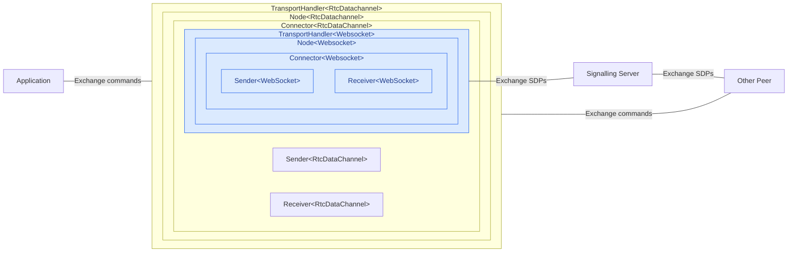
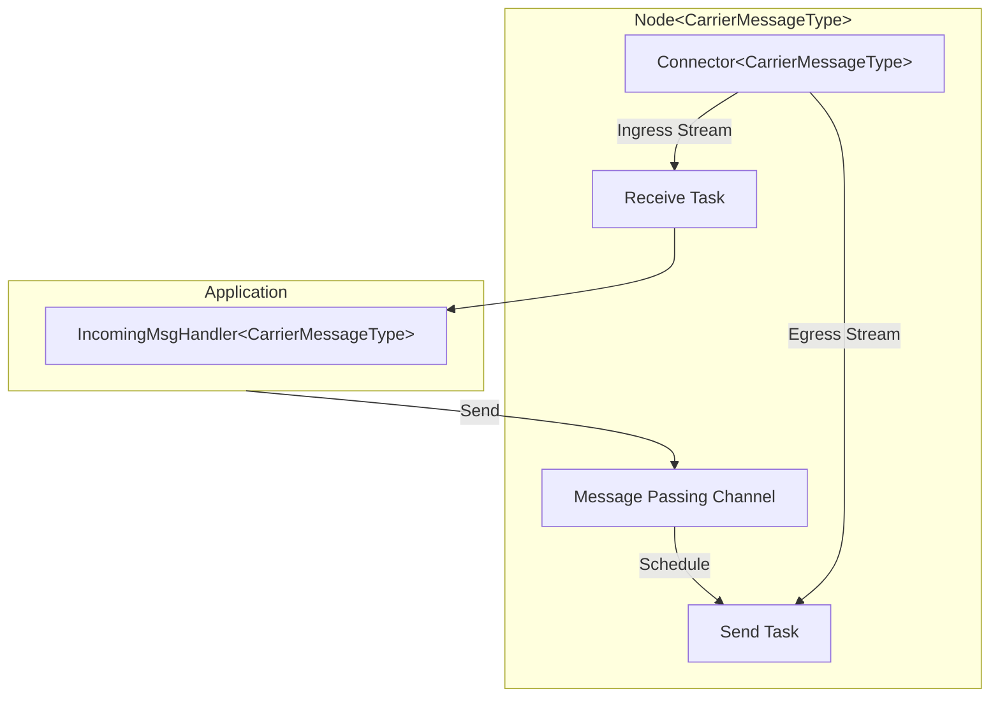
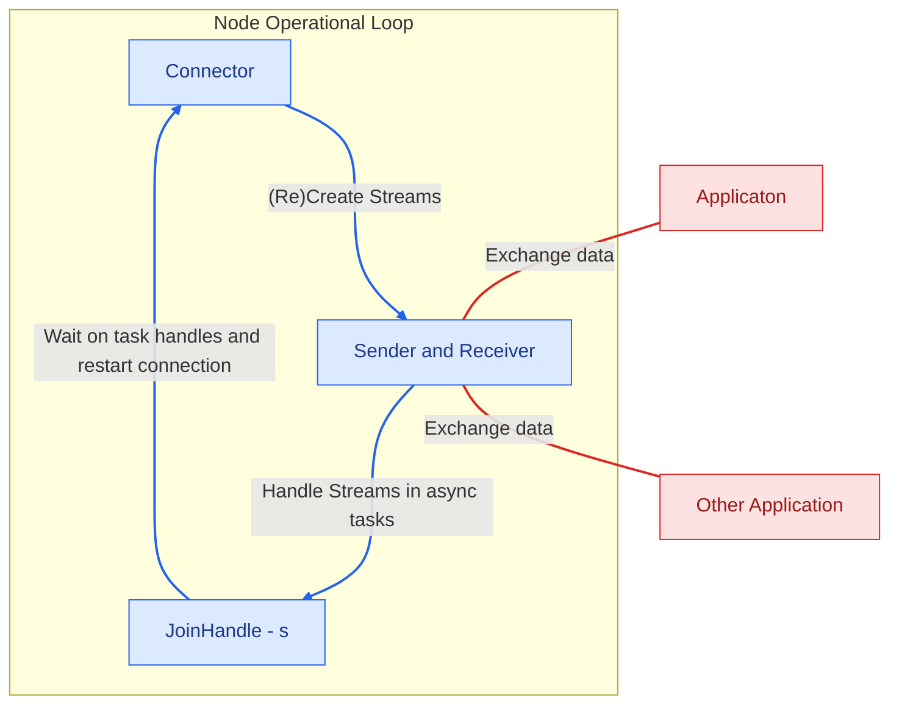
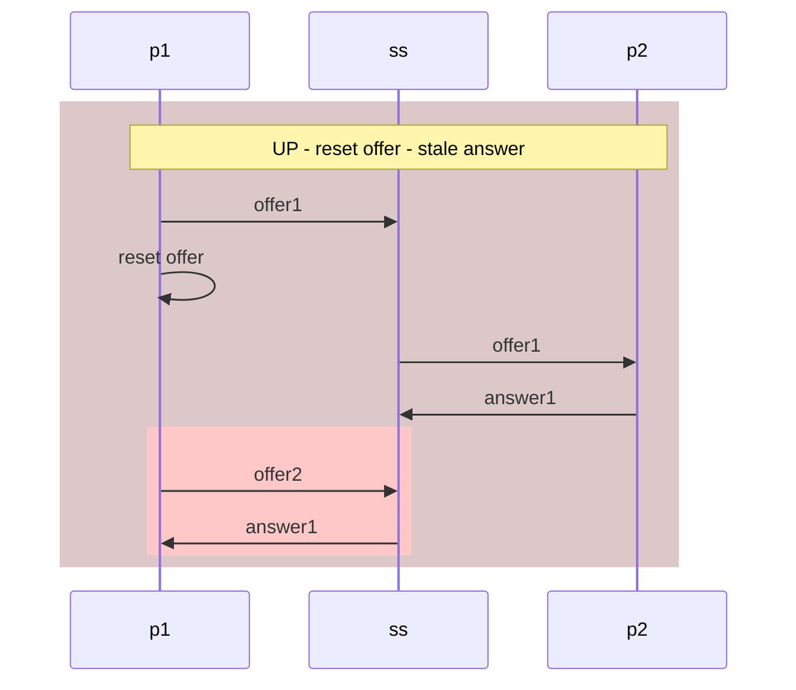
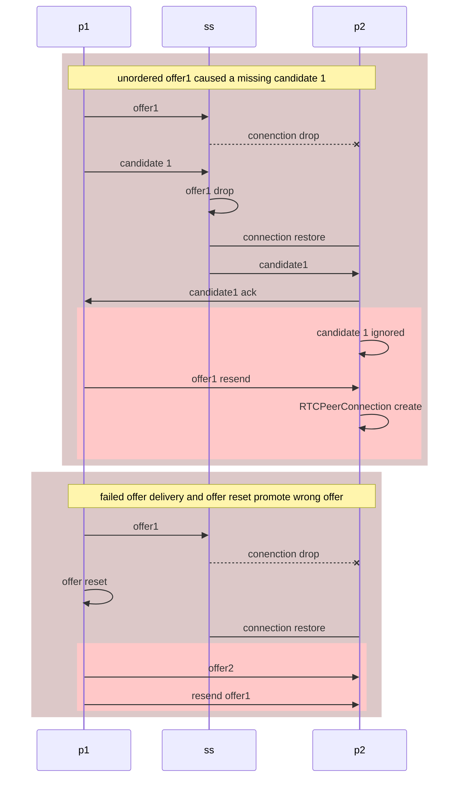
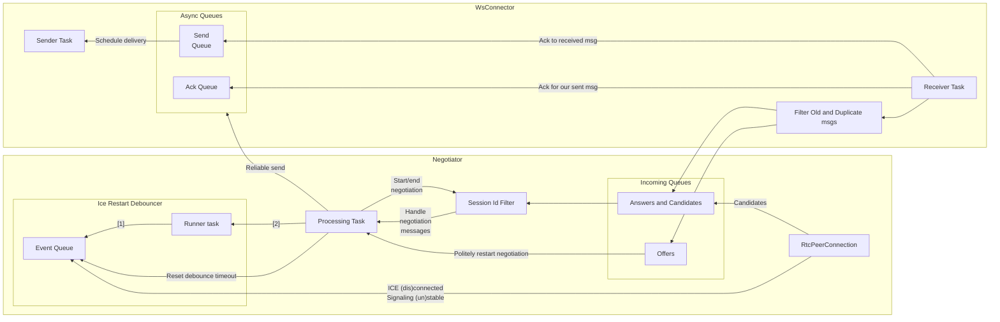

# <a id="rtcconnection">RtcConnection</a>

Handles ICE channel establishment and maintenance: restarts, (re)negotiation, trickle, signalling server communications.

Its goal is to open an RTCPeerConnection to the other peer and keep it alive to allow data exchange.

To ensure reliable connection the following need to be covered:
1. Connectivity to STUN/TURN servers - single server, retry connection till it is available or app is closed.
2. Connectivity to signalling server - single server, retry connection till it is available or app is closed.
3. Connectivity to the other peer - monitor state signalled by webrtc-rs library and trigger ICErestart when negotiation or disconnected state went on long enough.

Ideally, STUN/TURN and signalling servers need to be discovered, but here they are considered static and defined by a configuration.

# <a id="components">Components</a>
## <a id="hirarchy">Hirarchy</a>

```mermaid
flowchart LR
    subgraph rnh["TransportHandler&ltRtcDatachannel&gt"]
        subgraph rn["Node&ltRtcDatachannel&gt"]
            subgraph rc["Connector&ltRtcDataChannel&gt"]
                sendrtc["Sender&ltRtcDataChannel&gt"]
                recvrtc["Receiver&ltRtcDataChannel&gt"]
                subgraph wnh["TransportHandler&ltWebsocket&gt"]
                    subgraph wn["Node&ltWebsocket&gt"]
                        subgraph conws["Connector&ltWebsocket&gt"]
                            sendws["Sender&ltWebSocket&gt"]
                            recvws["Receiver&ltWebSocket&gt"]
                        end
                    end
                end
      
            end
        end
    end
    app["Application"]
    op["Other Peer"]
    ss["Signalling Server"]
    app---|"Exchange commands"| rnh
    rnh---|"Exchange commands"| op
    ss---|"Exchange SDPs"| op
    conws~~~ss
    wnh---|"Exchange SDPs"| ss
    classDef websocket fill:#dbeafe,stroke:#2563eb,color:#1e3a8a;
    class wnh,wn,conws,sendws,recvws websocket;
```
## <a id="node">Node</a>
This is an abstract/generic-ish asynchronious connection handler. It was decided to use once it became clear that the same processes were being used to construct a connection to some service wich would:
1. Not have message processing block the message receipt and vice versa.
2. Not have message sending also block program operation.
3. Handle reconnection automatically, without making any other routine wait for it.
To address this, the operation of this module is organised like so:


```mermaid
flowchart
    subgraph app["Application"]
        handler["IncomingMsgHandler&ltCarrierMessageType&gt"]
    end
    subgraph node["Node&ltCarrierMessageType&gt"]
        recv["Receive Task"]
        send["Send Task"]
        io["Message Passing Channel"]
        con["Connector&ltCarrierMessageType&gt"]
    end
    recv -->handler
    io -->|Schedule|send
    app -->|Send|io
    con --> |Ingress Stream|recv
    con --> |Egress Stream|send
```
As can be seen, node relies on an [abstract connector](#connector) which provides stream representing (a.k.a hiding) actual connections. Those could be streams for any kind of connections: TCP/ICE/Unix/ManualIO/etc and only Connector knows where to connect and how, not the Node. Those streams are also represented by opaque types: [Sender](#sender) and [Receiver](#receiver), which can perform any operation asynchroniously, while the node polls them for new messages or attempts sending.

That way the only thing Node is concerned about is how to exchange messages with the application and whether Node needs to restart its connection or not, which that is communicated by [Sender](#sender) and [Receiver](#receiver) when they fail and have dedicated async tasks closed.

### <a id="node_operation_loop">Operation</a>
The node runs an operational loop, where


```mermaid
flowchart
    subgraph node["Node Operational Loop"]
        con["Connector"]
        io["Sender and Receiver"]
        tasks["JoinHandle - s"]    
    end
    app["Applicaton"]
    op["Other Application"]

    app --- |Exchange data|io
    io --- |Exchange data|op
    con ---> |"(Re)Create Streams"|io
    io ---> |"Handle Streams in async tasks"|tasks
    tasks ---> |Wait on task handles and restart connection|con

    classDef blue fill:#dbeafe,stroke:#2563eb,color:#1e3a8a;
    classDef red fill:#fee2e2,stroke:#dc2626,color:#991b1b;
    class con,tasks,io blue;
    class app,op red;
    linkStyle 2,3,4 stroke:#2563eb,stroke-width:2px;
    linkStyle 0,1 stroke:#dc2626,stroke-width:2px;
```
As can be seen, Node only cares about how alive the streams are. It does not care much about how message delivery went. Its only goal is to initiate the connection establishment and was actually delivered, because message can be dropped by a Sender task (for example, if the connection is being restored).
It is not communicated back to the sender for tro reasons:
1. Make things simpler
2. The delivery is ensured using Acknowledgement messages in [another layer](#transporthandler)


## <a id="connector">Connector</a>
* This component provides [Sender](#sender) and [Receiver](#receiver) streams to transfer data over an opaque channel.
* The only job of the connector is to tell the [Node](#node) when it can send or not and when it needs to reconnect:
    * Whenever the [Sender](#sender) or [Receiver](#receiver) produce errors in sending or receiving messages, [Node](#node_operation_loop) will ask Connector for new ones, that will hopefully work.
* Its exact operation depends on implementation

### <a id="sender">Sender</a>

### <a id="receiver">Receiver</a>


The Connector provides interface to create new connection, but what happens underneath is implementation dependent. There are two implementations: Connector\<RtcDataChannel\> and Connector\<Websocket\>

### <a id="receiverrtcdatachannel">Receiver\<RtcDataChannel\></a>
This implementation of the receiver waits for the [connector](#connectorrtcdatachannel) to be at connected state and then starts to wait for new messages to arrive over the ingress stream.

### <a id="senderrtcdatachannel">Sender\<RtcDataChannel\></a>
This implementation of sender checks if the [connector](#connectorrtcdatachannel) is a connected state and either schedules message to send or drops it. The drop is done because the retransmission is handled by the [transport handler](#transporthandler).

### <a id="connectorrtcdatachannel">Connector\<RtcDataChannel\></a>
* This implementation is made to set up RtcDataChannel and keep it alive.
* The [Receiver](#receiverrtcdatachannel) and [Sender](#senderrtcdatachannel) keep the same reference to the underlying message passing channels to be able to hot swap the RtcDataChannel under the current session.
* The sending is allowed only when underlying RtcDataChannel is created and open.

#### Connection state
* The rust service only waits for incoming offers and this defines which states are possible:
    1. IceConnected_DataChannelOpen
    2. NoOp:
    ICE state will produce many events related to many session establishment components: temporary connection loss, datachannel closure, reopening, signalling state chane, which usually (but not always) goes with connection loss. What is important is that the [Sender](#senderrtcdatachannel) should wait for the IceConnected_DataChannelOpen state to send anything
#### Connector state
* Here is what is important about the connector state:
    1. The only thing that matters is the presense of an open RtcDataChannel during a connected ICE
    2. The connector is passive and does not initiate any ICE restart, so it does not matter how long has been since ICE connection was losts
    3. Connection to the signalling server must be kept open at all times, because any change to the connection must be communicated or requested by the Frontend, sending a new Offer
    4. Any problems with the connection must be addressed by the frontend, which means that whatever happens, Backend should just wait for a new offer.
>[!NOTE]
>Side note: The fact that there is no ICE restart on the Backend side also saves us from having to make Rust service to be an impolite peer (since webrtc-rs does not support rollback), which could cause some uncomfortable edge cases where signalling might get stuck because polite Frontend is waiting for impolite Backend. 


 
#### <a id="negotiation-handling">Negotiation handling:</a>
The core principles are described in https://developer.mozilla.org/en-US/docs/Web/API/WebRTC_API/Perfect_negotiation - polite peer will disregard negotiation that he initiated and take impolite peer's offer for basis.

   
#### <a id="stale-answers-and-candidates">Stale answers and candidates</a>

Even with measures against [message loss](#ack-messages) and [reordering](#unordered-messages) there is an unhappy path (UPs) that might cause wrong answers or candidate messages be addressed to negotiations session:


```mermaid
sequenceDiagram
    participant p1 as p1
    participant ss
    participant p2 as p2

        
    rect rgb(220, 200, 200)
    note over p1,p2: UP - reset offer - stale answer
    p1->>ss: offer1
    p1->>p1: reset offer
    ss->>p2: offer1
    p2->>ss: answer1
    rect rgb(260, 200, 200)
    p1->>ss: offer2
    ss->>p1: answer1
    end
    end
```
And this path is addressed by the [negotiation session id](#negotiation_session_id) 
#### <a id="negotiation_session_id">Negotiation session id</a> 
This id is introduced to make sure that session receives messages relevant to current sdp pair.


## <a id="transporthandler">TransportHandler</a>
* Transport handler is a generic wrapper around a [Node](#node) and it provides message [ordering](#unordered_signalling_messages_payload_seq_num) and [acknowledgements](#ack-messages). 
* It was decided to be made generic to be used during signalling session and during datachannel commungcations, because:
    * Despite datachannel working on top of reliable SCTP protocol with its own retransmits and ordering, the following problems remain:
        1. RTCDataChannel: send() method does not provide means to wait for a message to be delivered, such as promised result or a callback.
        2. There is no clean and reliable way in RTCDataChannel to confirm that the message even left the outgoing buffer. Polling buffersize would add complexity which would make the code less readeable and wouldnt guarantee that the message was actually delivered. bufferedAmount parameter only inditates quued messages that have not yet been passed to the system and docs don't explicitly guarantee that delivery results are communicated back in any way.
        3. In webrtc-rs implementation you could poll Association's stats on number of bytes sent, but it is not a documented way to determine that message was delivered either.
    >Side Note:
    >Though ordering is not necessary for datachannel messages, it will be a kind of a package deal here since it does not produce much overhead, given the context.

    * Signalling server [does not provide message forwarding feedback](../signalling/memo.md#sec_no_forward_ack) and its design allows an unreliable delivery to another peer:
    ```mermaid
        sequenceDiagram
            p1 ->> ss: connect
            p1 ->> ss: offer1
            rect rgb(260, 200, 200)
            ss ->> ss: discard offer1
            end
            p2 ->> ss: connect
            p1 ->> p1: resend timeout
            p1 ->> ss: resend offer1
            ss --x p2: connection lost
            rect rgb(260, 200, 200)
            ss ->> ss: discard offer1
            end
            ss -> p2: connection restored
    ```
    
    
#### <a id="ack-messages">Ack messages</a>
Ack messages were introduced for faster failure detection.

#### <a id="unordered-messages">Unordered messages</a>
But even with delivery confirmation, there is a problem of unordered message delivery, which would prompt some message buffering and preprocessing on the receiver's side:


```mermaid
sequenceDiagram
    participant p1
    participant ss
    participant p2
    rect rgb(220, 200, 200)
    note over p1, p2: unordered offer1 caused a missing candidate 1
    p1 ->> ss: offer1
    ss --x p2: conenction drop
    p1 ->> ss: candidate 1
    ss ->> ss: offer1 drop
    ss -> p2: connection restore
    ss ->> p2: candidate1
    p2 ->> p1: candidate1 ack
    rect rgb(260, 200, 200)
    p2 ->> p2: candidate 1 ignored
    p1 ->> p2: offer1 resend
    p2 ->> p2: RTCPeerConnection create
    end
    end

    rect rgb(220, 200, 200)
    note over p1, p2: failed offer delivery and offer reset promote wrong offer
    p1 ->> ss: offer1
    ss --x p2: conenction drop
    p1 ->> p1: offer reset
    ss -> p2: connection restore
    rect rgb(260, 200, 200)
    p1 ->> p2: offer2
    p1 ->> p2: resend offer1
    end
    end
```
Such [lack of order](#unordered-messages) is addressd by:
1. <a id="unordered_signalling_messages_payload_seq_num">Sequence numbers</a> in payload messages.
2. <a id="unordered_signalling_messgaes_hol">Send one message at a time</a>. It was chosen as an alternative to a reorder buffer to keep code simpler and message flow more steady as low latency is not as critical in the negotiation stage at this scale.


#### <a id="transport-handler-operation">Operation</a>
* Provide callback to [Node](#node) to receive incoming messages
* Send messages to [Node](#node) and retry until required ack arrives
* Keep track of outgoing seq numbers
* Decode incoming raw messges (and dont send acks on acks)
* Schedule acks on received regular messages (deliver unreliably)
* Use incoming acks to notify successful delivery
* Filter :
    1. <a id="ws_transport_filter">Old incoming seq numbers</a>
    2. Bad message: bad [rt tag](../signalling/memo.md#message_el_rtt_tag), non-text, failed parsing


### <a id="signalling-connection-handling-pipeline">Signalling connection handling pipeline</a>
If I get an ack for an element in the out queue, then I get another one when I resend it, and I cannot get one before I send it.


```mermaid
flowchart RL
    subgraph Block1["Negotiator"]
        subgraph IQ["Incoming Queues"]
            A1["Answers and Candidates"]
            A12["Offers"]
        end
        A2["Processing Task"]
        subgraph Db["Ice Restart Debouncer"]
            A11["Runner task"]
            A22["Event Queue"]
        end
        A3["Session Id Filter"]
        A4["RtcPeerConnection"]

        A12 -->|Politely restart negotiation| A2
        A4 -->|Candidates| A1
        A1 -->A3
        A3 -->|Handle<br>negotiation<br>messages| A2
        A4 -->|"ICE (dis)connected <br> Signaling (un)stable"| A22

        A2 -->|"Reset debounce timeout"| A22

        A11 --> |"[1]"| A22
        A2--> |"[2]"| A11
        A2 -->|Start/end<br>negotiation| A3
    end

   

    subgraph wsc["WsConnector"]
        subgraph queues["Async Queues"]
            C1["Send<br>Queue"]
            C2["Ack Queue"]
        end
        C4["Sender Task"]
        C5["Receiver Task"]
        C6["Filter Old and Duplicate msgs"]
        C1-->|Schedule delivery|C4
        C5-->C6
        C6-->A1
        C6 --> A12
        C5-->|Ack for our sent msg|C2
        C5-->|Ack to received msg|C1
    end

    A2 --> |Reliable send| queues
    
```


#### <a id="browser-implementation">Browser implementation</a>
Using flags to check for answer setting in progress is needed to see if negotiation is about to finish. BEcause single therad is used to schedule event processing, if flag is not set it would mean no answer was received yet at all.

