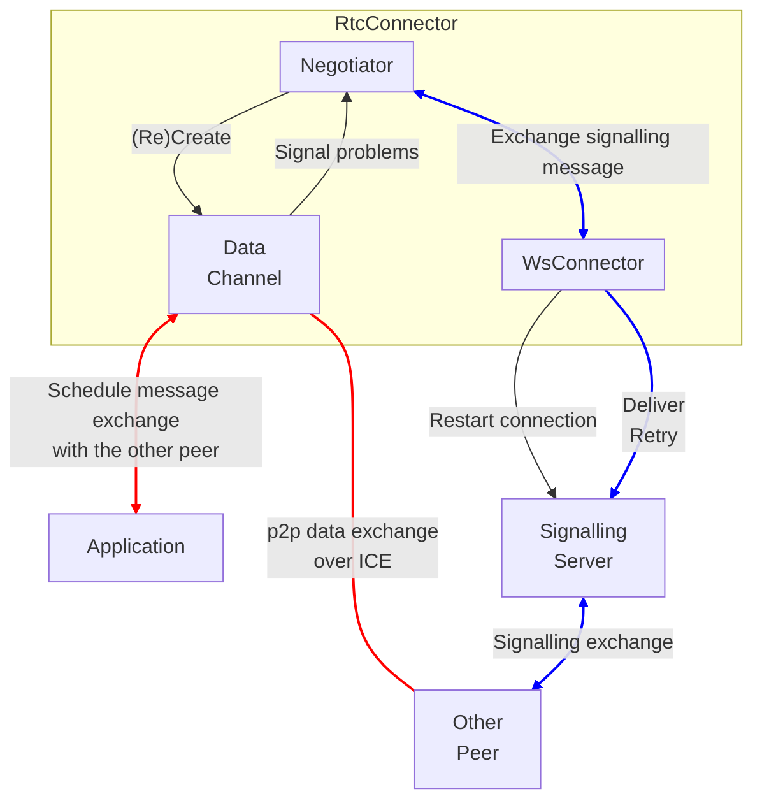
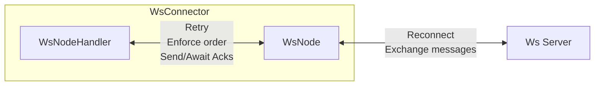
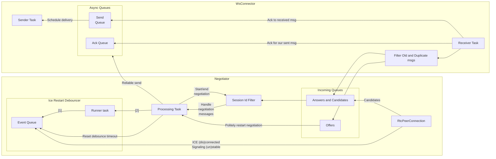
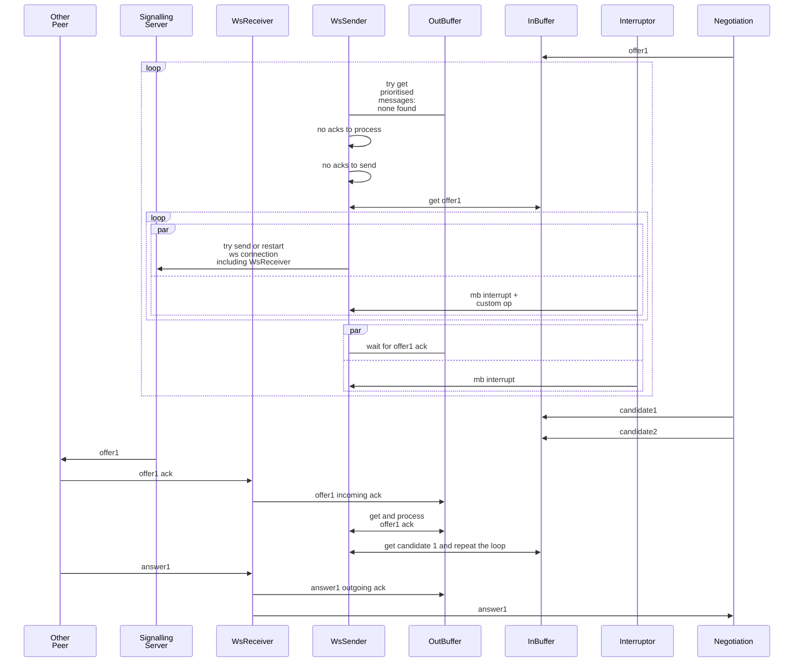
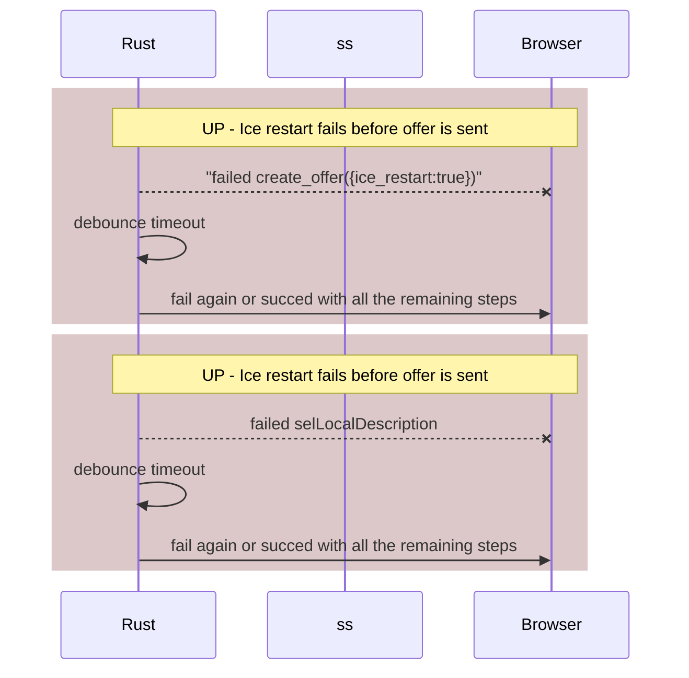

# RtcConnector

Handles ICE channel establishment and maintenance: restarts, (re)negotiation, trickle, signalling server communications.

Its goal is to open an RTCPeerConnection to the other peer and keep it alive to allow data exchange.

To ensure reliable connection the following need to be covered:
1. Connectivity to STUN/TURN servers - single server, retry connection till it is available or app is closed.
2. Connectivity to signalling server - single server, retry connection till it is available or app is closed.
3. Connectivity to the other peer - monitor state signalled by webrtc-rs library and trigger ICErestart when negotiation or disconnected state went on long enough.

Ideally, STUN/TURN and signalling servers need to be discovered, but here they are considered static and defined by a configuration.

### Components


```mermaid
flowchart
    app["Application"]
    subgraph rc["RtcConnector"]
        subgraph wc["WsConnector"]
        end
        subgraph neg["Negotiator"]
        end
        dc["Data<br>Channel"]
    end
    op["Other<br>Peer"]
    ss["Signalling<br>Server"]


    wc -->|Restart connection| ss
    wc -->|Deliver<br>Retry| ss
    neg <-->|Exchange signalling message| wc
    neg -->|"(Re)Create"| dc
    dc -->|Signal problems| neg
    dc <-->|Schedule message exchange<br>with the other peer| app

    dc --- |p2p data exchange<br>over ICE|op

    ss <--> |Signalling exchange|op

    linkStyle 6,5 stroke:#ff0000,stroke-width:2px
    linkStyle 1,2,7 stroke:#0000ff,stroke-width:2px
    

```

## WsConnector:

```mermaid
flowchart LR
    subgraph wscon["WsConnector"]
        ch["WsNodeHandler"]
        wsn["WsNode"]
    end
    wsn <---> |Reconnect<br>Exchange messages|wss["Ws Server"]
    ch <---> |Retry<br>Enforce order<br>Send/Await Acks|wsn
```
### WsNode

### WsNodeHandler
* Read rx queue and decode transport messages
* Schedule acks on incoming data
* Retry sending a message at intervals (one send at a time)
* Track incoming acks and notify sending task
* Keep track of outgoing seq numbers
* <a id="ws_transport_filter">Filter</a> old incoming seq numbers 
>[!NOTE]
>Side note: if we received but failed to process a message and the other peer retries, session might get stuck. Or the other peer migh want to replay the response - those cases are not supported for simplicity and keeping things pragmatic, because it fixes itself by restarting session, at the expense of some delay. Failed processing causes - bad/flaky ICE servers, bad message format, queue overflow.

one task is scraping rx queue
1. Bad message: bad [rt tag](../signalling/memo.md#message_el_rtt_tag), non-text, failed parsing, [filtered](#ws_transport_filter)
2. Data message: schedule an ack message without confirmation and pass the data to a provided processing handler, which must not return a future because wsNode must not be blocked.
3. Ack message: add it to the record of ack messages


### Negotiation Flow
There are several parallel control flows:
1. #### Connection to signalling server:
    Keep reestablishing connection while it is required. Otherwise close it.
2. #### Connection to another participant:

    Signalling server [does not provide message forwarding feedback](../signalling/memo.md##sec_no_forward_ack) and its design allows an unreliable delivery to another peer:
    ```mermaid
    sequenceDiagram
        p1 ->> ss: connect
        p1 ->> ss: offer1
        rect rgb(260, 200, 200)
        ss ->> ss: discard offer1
        end
        p2 ->> ss: connect
        p1 ->> p1: resend timeout
        p1 ->> ss: resend offer1
        ss --x p2: connection lost
        rect rgb(260, 200, 200)
        ss ->> ss: discard offer1
        end
        ss -> p2: connection restored
    ```
    #### Ack messages
     Ack messages were introduced for faster failure detection.
    
    Acks are sent back to the sender, so that the sender can identify a networking issue and retry the delivery. 
     
     Delivery retries were decided to move away from the [negotiation layer](#negotiation-handling) for simplicity. Negotiator will only track stale state timeout to restart negotiation itself, not to resend concrete messages (out buffer overflow = failure to send, timeout = clear buffer and renegotiate).

     #### Unordered messages
    But even with delivery confirmation, there is a problem of unordered message delivery, which would prompt some message buffering and preprocessing on the receiver's side:

      ```mermaid
    sequenceDiagram
        participant p1
        participant ss
        participant p2
        rect rgb(220, 200, 200)
        note over p1, p2: unordered offer1 caused a missing candidate 1
        p1 ->> ss: offer1
        ss --x p2: conenction drop
        p1 ->> ss: candidate 1
        ss ->> ss: offer1 drop
        ss -> p2: connection restore
        ss ->> p2: candidate1
        p2 ->> p1: candidate1 ack
        rect rgb(260, 200, 200)
        p2 ->> p2: candidate 1 ignored
        p1 ->> p2: offer1 resend
        p2 ->> p2: RTCPeerConnection create
        end
        end

        rect rgb(220, 200, 200)
        note over p1, p2: failed offer delivery and offer reset promote wrong offer
        p1 ->> ss: offer1
        ss --x p2: conenction drop
        p1 ->> p1: offer reset
        ss -> p2: connection restore
        rect rgb(260, 200, 200)
        p1 ->> p2: offer2
        p1 ->> p2: resend offer1
        end
        end
    ```
    Such [lack of order](#unordered-messages) is addressd by:
    1. <a id="unordered_signalling_messages_payload_seq_num">Sequence numbers</a> in payload messages.
    2. <a id="unordered_signalling_messgaes_hol">Send one message at a time</a>. It was chosen as an alternative to a reorder buffer to keep code simpler and message flow more steady as low latency is not as critical in the negotiation stage at this scale.

3. #### Negotiation handling:
    The core principles are described in https://developer.mozilla.org/en-US/docs/Web/API/WebRTC_API/Perfect_negotiation - polite peer will disregard negotiation that he initiated and take impolite peer's offer for basis.

    ```mermaid
    sequenceDiagram
        participant p1 as Polite
        participant ss
        participant p2 as Impolite
        p1 ->> ss: polite offer
        p2 ->> ss: impolite offer
        ss ->> p1: impolite offer
        ss ->> p2: polite offer
        p2 ->> p2: drop polite offer
        p1 ->> p1: rollback and take impolite offer
        p1 ->> p2: impolite answer
    ```
    ### Stale answers and candidates

    Even with measures against [message loss](#ack-messages) and [reordering](#unordered-messages) there are several unhappy paths (UPs) that might cause wrong answers or candidate messages be addressed to negotiations session:

    ```mermaid
    sequenceDiagram
        participant p1 as Polite
        participant ss
        participant p2 as Impolite

          
        rect rgb(220, 200, 200)
        note over p1,p2: UP - reset offer - stale answer
        p1->>ss: offer1
        p1->>p1: reset offer
        ss->>p2: offer1
        p2->>ss: answer1
        rect rgb(260, 200, 200)
        p1->>ss: offer2
        ss->>p1: answer1
        end
        end
 
        rect rgb(220, 200, 200)
        note over p1,p2: UP - reset offer - stale answer 2
        p1->>ss: offer1
        p2->>ss: offer2
        ss->>p2: offer1
        p2->>p2: discard offer1
        ss->>p1: offer2
        p1->>p1: rollback offer1
        p1->>ss: answer2
        p2->>p2: reset connection
        rect rgb(260, 200, 200)
        p2->>ss: offer3
        ss->>p2: answer2
        end
        end
    ```
    
    <a id="negotiation_session_id">Negotiation session id</a> is introduced to make sure that session receives messages relevant to current sdp pair.


### Signalling connection handling pipeline
If I get an ack for an element in the out queue, then I get another one when I resend it, and I cannot get one before I send it.


```mermaid
flowchart RL
    subgraph Block1["Negotiator"]
        subgraph IQ["Incoming Queues"]
            A1["Answers and Candidates"]
            A12["Offers"]
        end
        A2["Processing Task"]
        subgraph Db["Ice Restart Debouncer"]
            A11["Runner task"]
            A22["Event Queue"]
        end
        A3["Session Id Filter"]
        A4["RtcPeerConnection"]

        A12 -->|Politely restart negotiation| A2
        A4 -->|Candidates| A1
        A1 -->A3
        A3 -->|Handle<br>negotiation<br>messages| A2
        A4 -->|"ICE (dis)connected <br> Signaling (un)stable"| A22

        A2 -->|"Reset debounce timeout"| A22

        A11 --> |"[1]"| A22
        A2--> |"[2]"| A11
        A2 -->|Start/end<br>negotiation| A3
    end

   

    subgraph wsc["WsConnector"]
        subgraph queues["Async Queues"]
            C1["Send<br>Queue"]
            C2["Ack Queue"]
        end
        C4["Sender Task"]
        C5["Receiver Task"]
        C6["Filter Old and Duplicate msgs"]
        C1-->|Schedule delivery|C4
        C5-->C6
        C6-->A1
        C6 --> A12
        C5-->|Ack for our sent msg|C2
        C5-->|Ack to received msg|C1
    end

    A2 --> |Reliable send| queues
    
```
#### Footnotes
* [1]: Get events - update state - switch between timed (debouncing) or passive queue polling
* [2]: Spawn a task - poll completion - trigger an ICE restart


```mermaid
    sequenceDiagram
        participant p as Other<br>Peer
        participant ss as Signalling<br>Server
        participant pcrec as WsReceiver
        participant wc as WsSender
        participant pcout as OutBuffer
        participant pcn as InBuffer
        participant i as Interruptor
        participant neg as Negotiation
        neg ->> pcn: offer1
        loop
            wc -> pcout: try get <br> prioritised  <br>  messages: <br> none found
            wc ->> wc: no acks to process
            wc ->> wc: no acks to send        
            wc <<->> pcn: get offer1
            loop
                par
                    wc ->> ss: try send or restart <br> ws connection <br> including WsReceiver
                    and
                    i ->> wc: mb interrupt + <br> custom op
                end
            end
            par
                wc -> pcout: wait for offer1 ack
            and
                i ->> wc: mb interrupt
            end
        end

        neg ->> pcn: candidate1
        neg ->> pcn: candidate2
        ss ->>p: offer1
        p ->> pcrec: offer1 ack
        pcrec ->> pcout : offer1 incoming ack

        wc <<->> pcout : get and process <br> offer1 ack
        wc <<->>  pcn: get candidate 1 and repeat the loop

        p ->> pcrec : answer1
        pcrec ->> pcout : answer1 outgoing ack 
        pcrec ->> neg : answer1

```

### Restarting ICE
1. 


#### Rust Implementation
##### Always impolite
Rust client does not support rollback operations for remote and local sdps.
So it will be impolite.
And it will reset RTCPeerConnection if it fails to get out of "have-remote-offer" state.

If the rust tries to restart ice connection and hangs for some reason, it will remain like that
until it finishes his negotiation session and will ignore any unrelated signalling from the other peer.

The following cases are not handled exclusively because it is unclear what can cause them during current operation:


```mermaid
sequenceDiagram
    participant p1 as Rust
    participant ss
    participant p2 as Browser

    rect rgb(220, 200, 200)
    note over p1,p2: UP - Ice restart fails before offer is sent
    p1 --x p2: "failed create_offer({ice_restart:true})"
    p1->>p1: debounce timeout
    p1 ->> p2: fail again or succed with all the remaining steps
    end

    rect rgb(220, 200, 200)
    note over p1,p2: UP - Ice restart fails before offer is sent
    p1 --x p2: failed selLocalDescription
    p1->>p1: debounce timeout
    p1 ->> p2: fail again or succed with all the remaining steps
    end

```
    


#### Browser implementation
Using flags to check for answer setting in progress is needed to see if negotiation is about to finish. BEcause single therad is used to schedule event processing, if flag is not set it would mean no answer was received at all.

