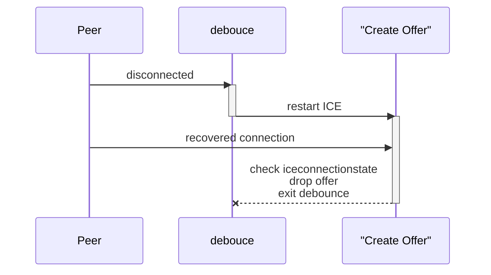
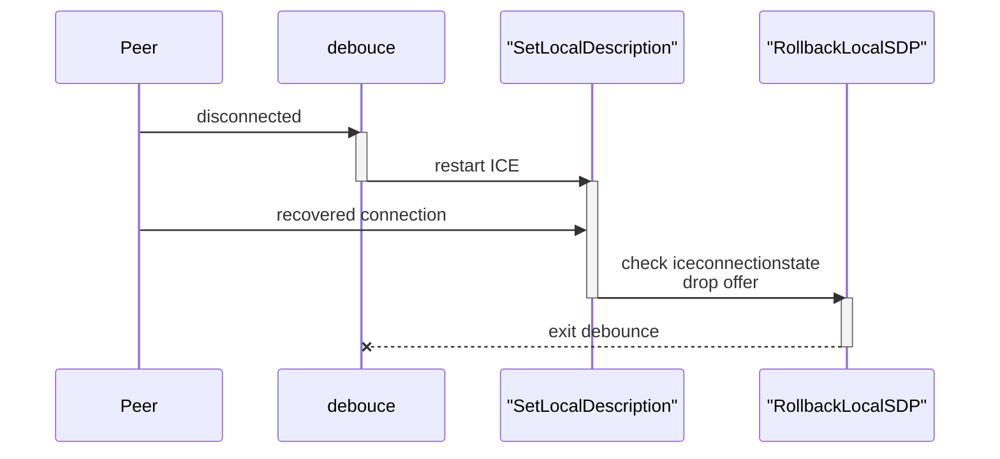
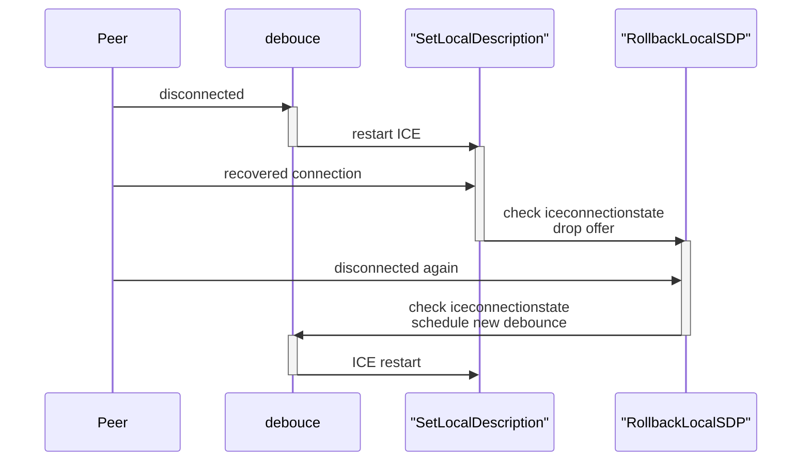

# Command Dispatcher

The frontend sends commands to backend (duh).
The delivery channel should be made opaque to separate transport layers.
The following commands are sent to backend:
1. Database requests - when transferring big data need to split and reassemble it.
2. Website code request - a long data buffer. Need to split data when sending over SCTP.

The message format would be

