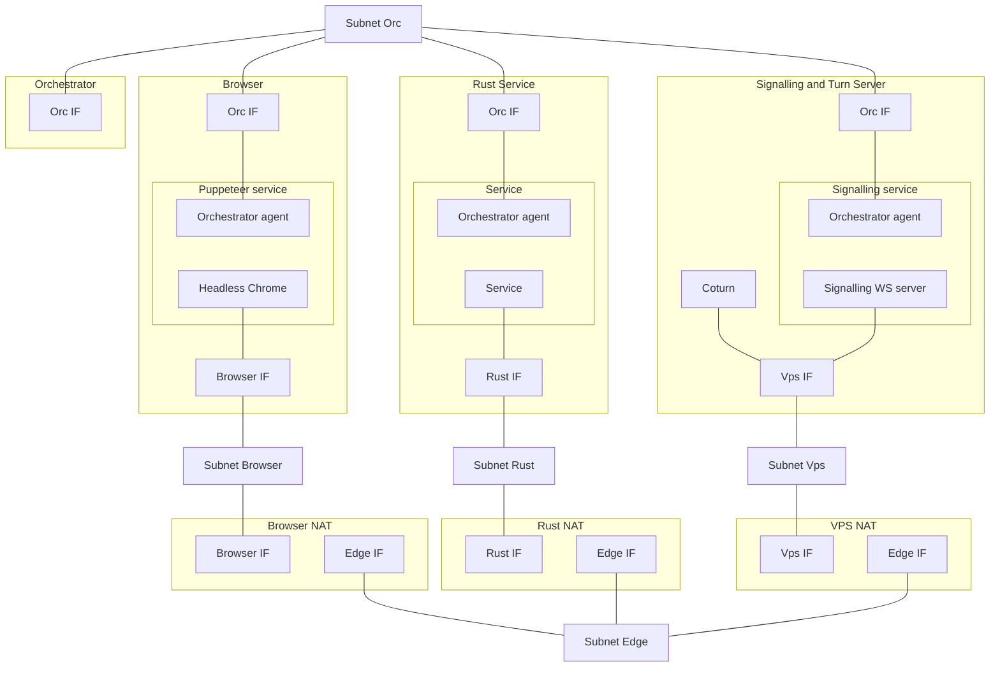

To test WebRTC datachannel connectivity a set of services will be deployed.
The following things will need to be tested:
1) Carrier change
2) Connectivity loss
3) Ice restarts
4) Page reloads
5) Regular operation over opened data channel

All services will have to be deployed:
1) Browser
2) Turn server
3) Signalling server
4) Rust service
5) Test orchestration service
6) Browser NAT connects with (1)
7) Rust NAT connects with (4)
8) vps nat connects with (3)

* (2) and (4) will need to have at least 2 interfaces for connection with each other
* (2) and (4) will have to be behind NATs to emulate real world networks
* Extra interface will have to exist to connect everyone with the (5)

### Orchestration

#### Orchestration script
Runs first.
Builds rust artifacts.
Runs the docker compose sript and provides environment variables required to provide mounting points, source directories and the artifacts and other variables to expose to the sevice mesh.

#### Orchestration service
Sends commands to other services and observes results.
Synchronises events.
Decides if tests pass or fail.

#### Carrier change
Emulated as swapping network interfaces: disable old interface and enable new one.